# Basic Bitch Steno Build Guide

Basic Bitch Steno (BBS or BB Steno) Keyboard - start learning how to use stenography.

This is for the prototypes build as of Jan 2023, and this document should be updated if/when a production version is released.

[Product Page](https://mechwild.com/product/bb-steno/)

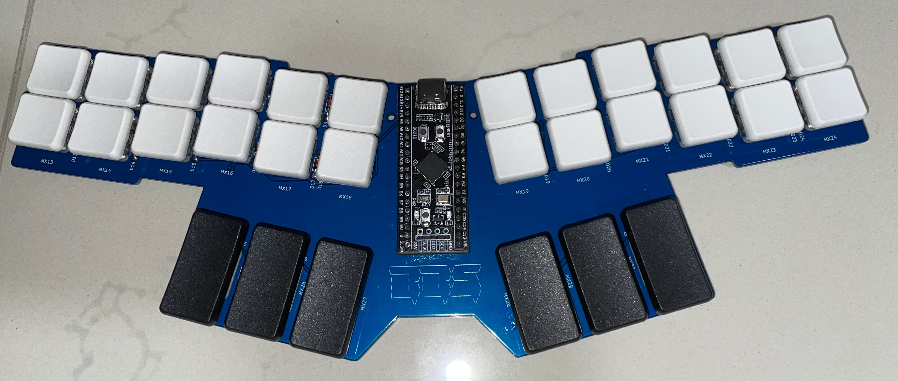

# Table of Contents

- [Basic Bitch Steno Build Guide](#basic-bitch-steno-build-guide)
- [Table of Contents](#table-of-contents)
- [Required Tools](#required-tools)
- [Recommended Tools](#recommended-tools)
- [Kit Contents](#kit-contents)
- [Components you need to get](#components-you-need-to-get)
  - [Switches](#switches)
  - [Keycaps](#keycaps)
- [Step 0: Test and Flash Your Blackpill](#step-0-test-and-flash-your-blackpill)
  - [Flashing](#flashing)
- [Step 1: Diodes](#step-1-diodes)
- [Step 2: Blackpill](#step-2-blackpill)
- [Step 3: Testing connectivity](#step-3-testing-connectivity)
- [Step 4: The switches](#step-4-the-switches)
- [Step 5: Keycaps and Bumpons](#step-5-keycaps-and-bumpons)

# Required Tools

These tools and components are required to complete the project and are not included in the kit. The linked names of the components will generally link to a place where you can buy them.

- [Soldering Iron](https://www.amazon.com/s?k=soldering+iron)
  - Preferably a medium or small tip to make soldering the components easier.
- [Solder Wire](https://www.amazon.com/s?k=solder+wire+63%2F37+rosin+core)
  - I recommend a thinner 63/37 rosin core solder wire. [Kester Solder 63/37 .015 Dia](https://www.amazon.com/gp/product/B004X4L076).
- [Flush Cutters](https://mechwild.com/product/flush-cutters/)
- [Small Phillips Head Screwdriver](https://www.amazon.com/s?k=screwdriver+kit)

# Recommended Tools

These tools are not necessary to complete the build, but might make the process a little easier for you or help you correct mistakes if you make them.

- Through-Hole leg bender forming tool
- Solder Sucker
- Solder Wick
- [Switch Puller](https://mechwild.com/product/switch-puller/)

# Kit Contents

Note: You might have extras of some components. This is normal and is to account for small mistakes.

- PCB

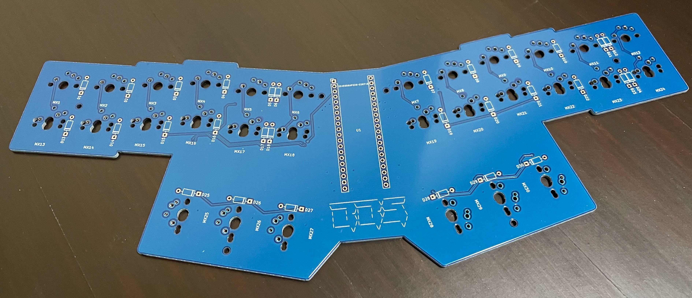

- Blackpill

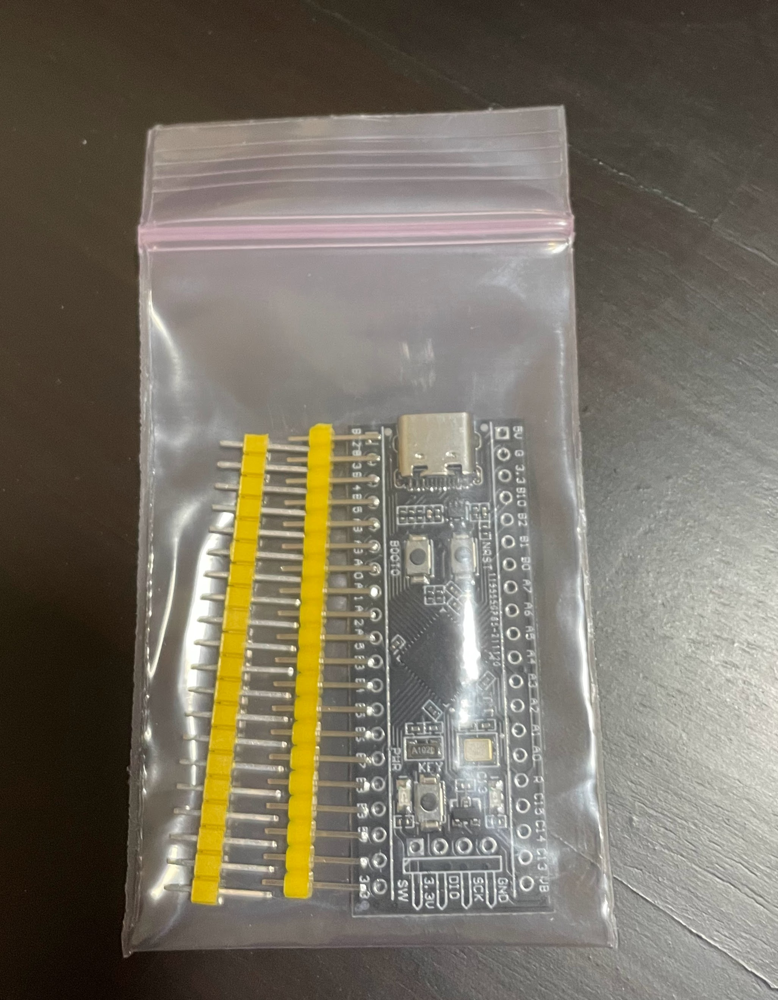

- Diodes (30)

")

- 8x Rubber bumpons (feet)

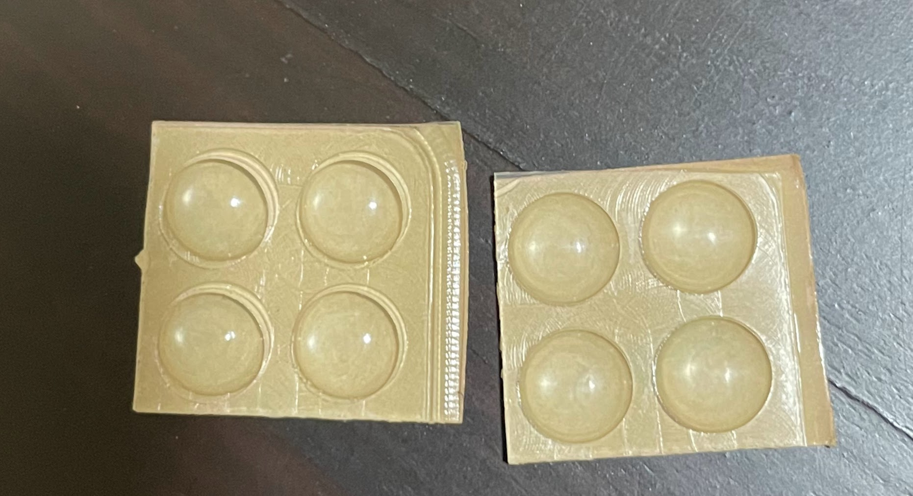

- Socket and Pins (optional)

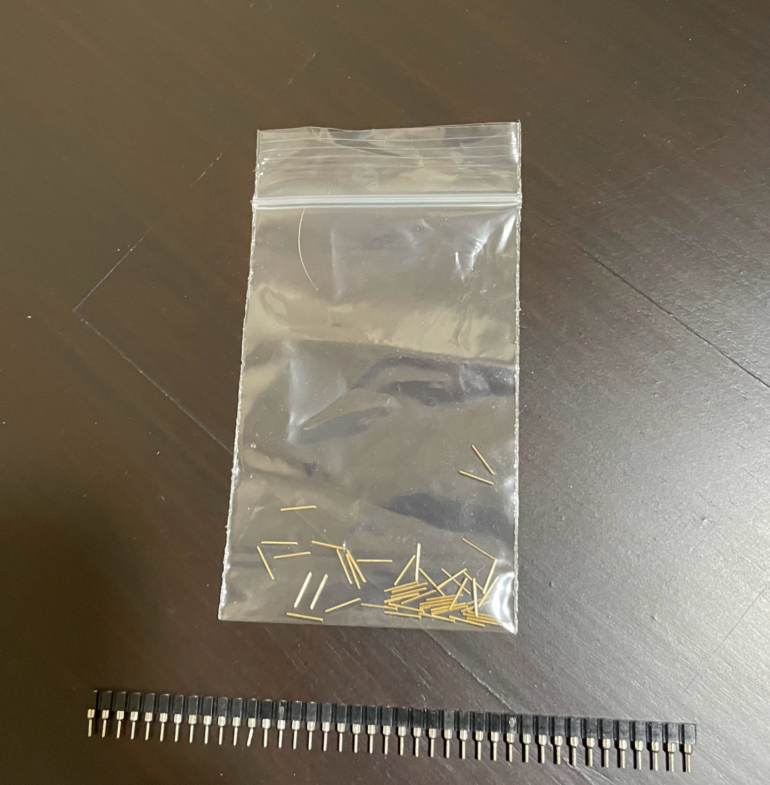

# Components you need to get

## Switches

This PCB is compatible with both Cherry MX-style, and Kailh Choc (**V1**, not V2).

Since I wanted keys which are low profile, I went with the Kailh Chocs.

For steno, the consensus seems to be towards switches which are as light as possible, so I selected "Pink" (20g). "Light Blue" (20-25g) also seems to have availability is some places, although it is supposed to be discontinued.

There are other options available, so choose what you prefer. [MKUltra page](https://mkultra.click/choc-switches), but you can also find it on [Aliexpress](https://www.aliexpress.com/item/1005004469105975.html) - will need to look closely that you're getting the right ones!

You will need 30 switches in total.

## Keycaps

To get exactly what you see in the product description picture, you will need:

- 24x 1u
- 6x 1.75u for vowels and numbar

Do remember you should be getting keycaps compatible with your selected switches!

For Kailh, I got these:

- [1u PBT low profile Choc Keycaps](https://www.aliexpress.com/item/1005004558099208.html)
- [1.75u PBT low profile Choc Keycaps](https://www.aliexpress.com/item/1005004780019538.html)

# Step 0: Test and Flash Your Blackpill

You can test your blackpill by connecting your blackpill to your computer, and selecting the following in Plover:

1. Configure -> Machine tab
2. Machine: "Gemini PR"
3. Select the "Scan" button in Options: Connection
4. You should be able to select "BB Steno" under "Port"

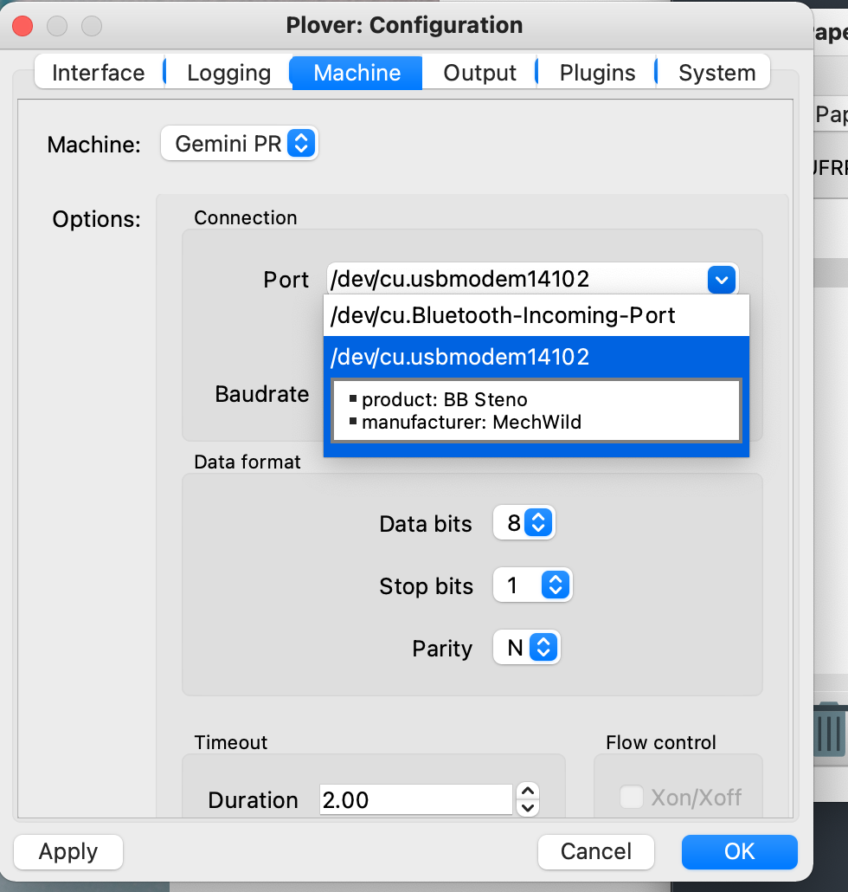

## Flashing

Your blackpill should come to you preflashed with bbs firmware, but if you are sourcing your own, or for some reason, your blackpill is flashed with something else, you can follow these steps to flash it.

Firmware is on our firmware repo, available here:
[https://github.com/MechWild/mw_firmware/releases](https://github.com/MechWild/mw_firmware/releases)

To put the blackpill into bootloader mode, press and hold the `boot0` button on the blackpill, tap and release the `nrst` button on the blackpill, then release the `boot0` button.

Once in bootloader mode, [QMK Toolbox](https://github.com/qmk/qmk_toolbox) can be used to flash the firmware to your blackpill.

# Step 1: Diodes

THE DIRECTION THAT THE DIODE IS FACING WHEN YOU SOLDER IT ON MATTERS. A LOT.

Read through this guide here:

[Soldering Diodes](https://mechwild.com/guides/general/diodes/)

Here is what it should look like when it is done:

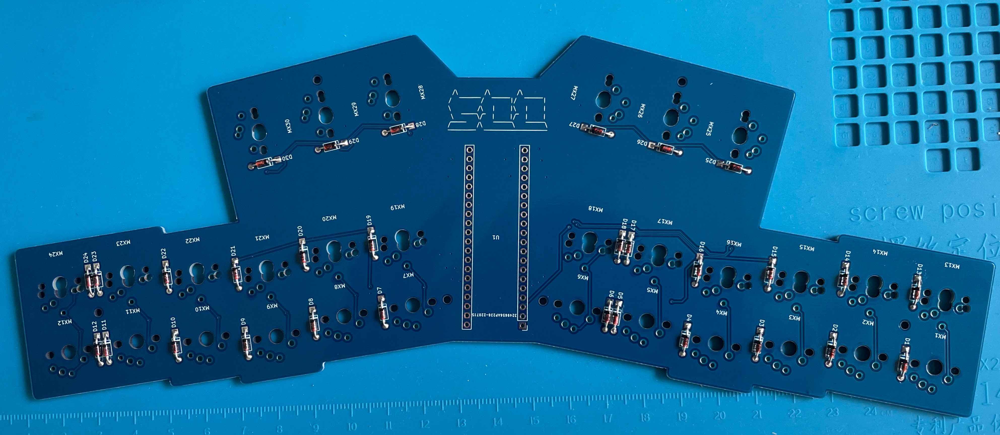

# Step 2: Blackpill

If you opted to get the strip sockets and pins, this is a [good guide](https://filterpaper.github.io/socket-mcu.html) on how to socket your MCUs.

If you are permanently soldering in the Blackpill:

Rest the pin headers in the PCB with the short side of the pins in the PCB and then put the black pill onto the pins and make sure it is sitting flush. The components on the black pill should be facing AWAY from the main PCB. There are buttons on the PCB that you will need to push at some point to put it back into bootloader mode, so make sure you solder the black pill on in a way where you can do that. After that solder the black pill on this way:

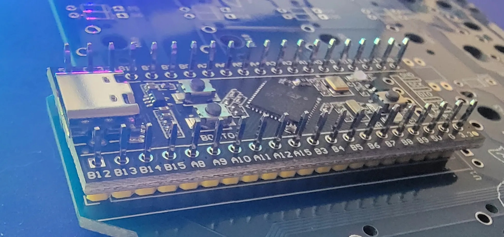

Once it is soldered, trim the long side of the pins that is excess on the top of the black pill.

# Step 3: Testing connectivity

After you have it soldered on, plug it in and see if it works by connecting the spots for the switches with tweezers, or any of your normal tests for boards.

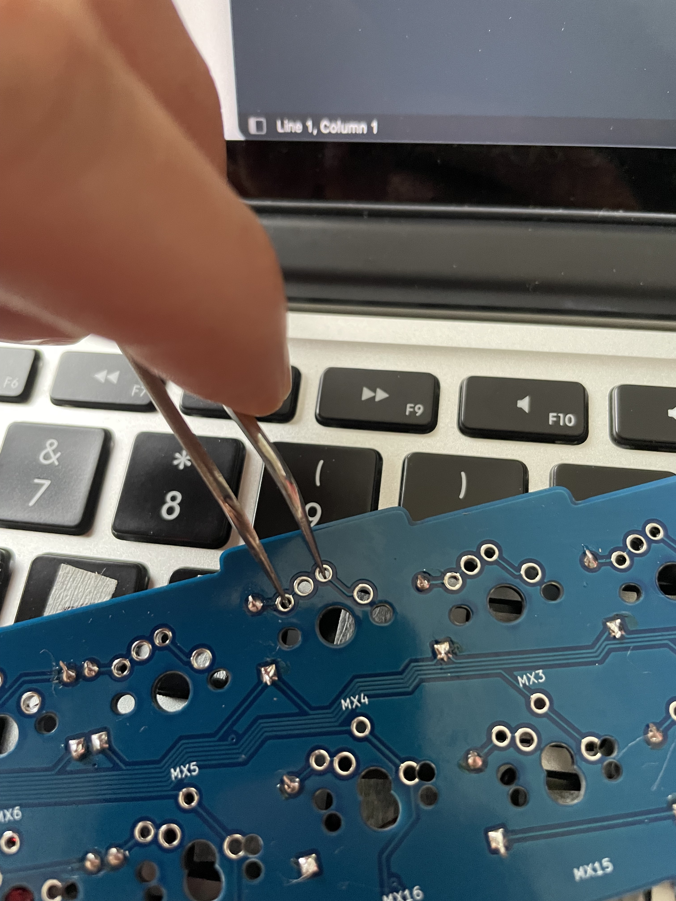

You can connect to Plover like in [Step 0](#step-0-test-and-flash-your-blackpill), and use Plover's Paper Tape function to check that all the key contacts work. You should be able to get the full Steno order - make sure all the keys produce an output in the paper tape.

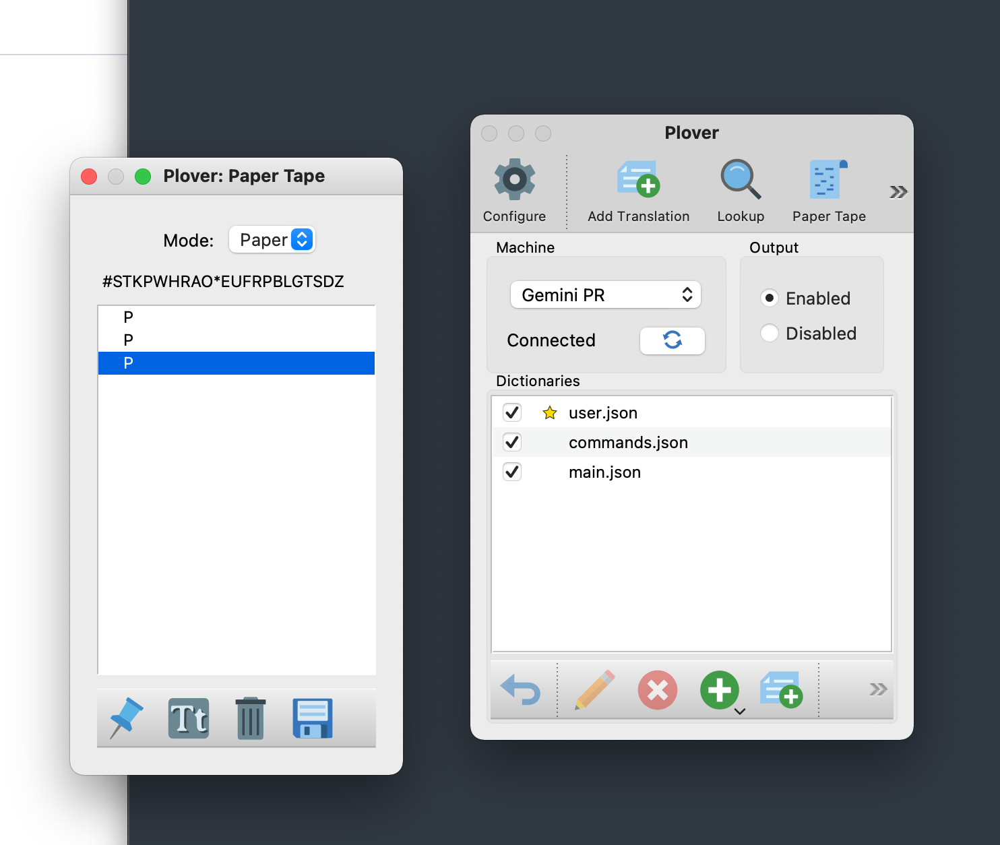

If any keys don't produce an output, check your soldering for cold joints, and that all your diodes are orientated correctly.

# Step 4: The switches

Once you have confirmed that everything works as expected, you can proceed to solder in the switches.

Please make sure to test before this step, because fixing things is WAY easier before it is fully assembled.

# Step 5: Keycaps and Bumpons

Keycap it up, stick the bumpons under your PCB, and start practicing your steno!

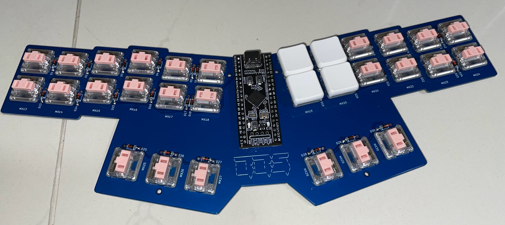
